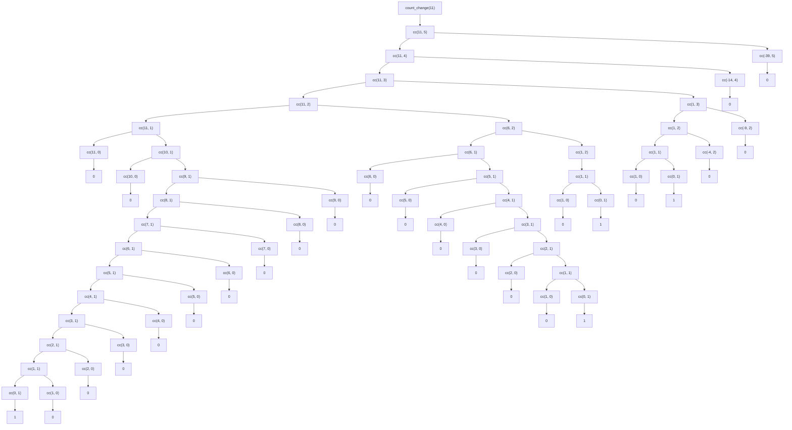

```mermaid
flowchart TB
    A1["count_change(11)"] --> B1["cc(11, 5)"]
    B1 --> C1["cc(11, 4)"] & C2["cc(-39, 5)"]
    C1 --> D1["cc(11, 3)"] & D2["cc(-14, 4)"]
    D1 --> E1["cc(11, 2)"] & E2["cc(1, 3)"]
    E1 --> F1["cc(11, 1)"] & F2["cc(6, 2)"]
    F1 --> G1["cc(11, 0)"] & G2["cc(10, 1)"]
    G1 --> END0["0"]
    C2 --> END1["0"]
    D2 --> END2["0"]
    E2 --> F3["cc(1, 2)"] & F4["cc(-9, 2)"]
    F3 --> G3["cc(1, 1)"] & G4["cc(-4, 2)"]
    G3 --> H1["cc(1, 0)"] & n1["cc(0, 1)"]
    H1 --> END4["0"]
    G4 --> END5["0"]
    F4 --> END3["0"]
    n1 --> n2["1"]
    F2 --> n3["cc(6, 1)"] & n6["cc(1, 2)"]
    n3 --> n4["cc(6, 0)"] & n12["cc(5, 1)"]
    n4 --> n5["0"]
    n6 --> n7["cc(1, 1)"]
    n7 --> n8["cc(1, 0)"] & n9["cc(0, 1)"]
    n8 --> n10["0"]
    n9 --> n11["1"]
    n12 --> n13["cc(5, 0)"] & n15["cc(4, 1)"]
    n13 --> n14["0"]
    n15 --> n16["cc(4, 0)"] & n18["cc(3, 1)"]
    n16 --> n17["0"]
    n18 --> n19["cc(3, 0)"] & n21["cc(2, 1)"]
    n19 --> n20["0"]
    n21 --> n22["cc(2, 0)"] & n24["cc(1, 1)"]
    n22 --> n23["0"]
    n24 --> n25["cc(1, 0)"] & n26["cc(0, 1)"]
    n26 --> n27["1"]
    n25 --> n28["0"]
    n29["cc(10, 0)"] --> n30["0"]
    G2 --> n29 & n31["cc(9, 1)"]
    n31 --> n32["cc(8, 1)"] & n41["cc(9, 0)"]
    n33["cc(7, 1)"] --> n34["cc(6, 1)"] & n43["cc(7, 0)"]
    n34 --> n35["cc(5, 1)"] & n44["cc(6, 0)"]
    n35 --> n36["cc(4, 1)"] & n45["cc(5, 0)"]
    n36 --> n37["cc(3, 1)"] & n46["cc(4, 0)"]
    n37 --> n38["cc(2, 1)"] & n47["cc(3, 0)"]
    n38 --> n39["cc(1, 1)"] & n48["cc(2, 0)"]
    n39 --> n40["cc(0, 1)"] & n49["cc(1, 0)"]
    n32 --> n33 & n42["cc(8, 0)"]
    n41 --> n51["0"]
    n43 --> n52["0"]
    n42 --> n53["0"]
    n44 --> n54["0"]
    n45 --> n55["0"]
    n46 --> n56["0"]
    n47 --> n57["0"]
    n48 --> n58["0"]
    n49 --> n59["0"]
    n40 --> n50["1"]
```