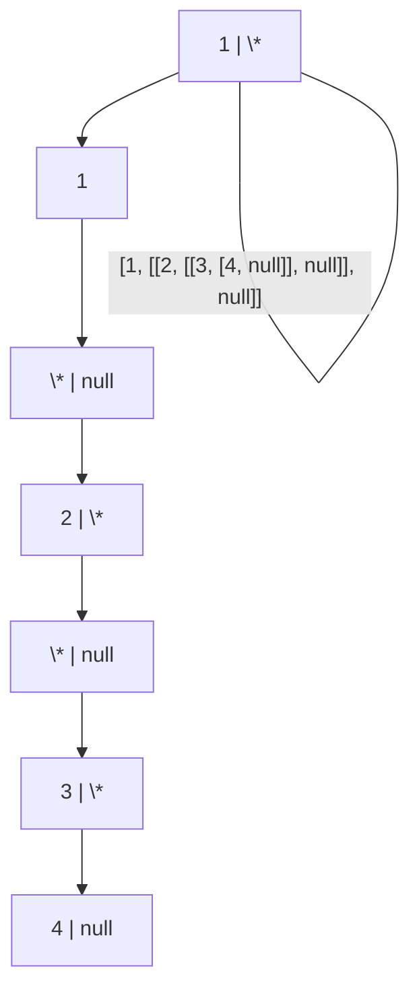

```mermaid
flowchart TD;
  a["1 | \*"] --> b[1]
  --> c["\* | null"]
  --> d["2 | \*"]
  --> e["\* | null"]
  --> f["3 | \*"]
  --> g["4 | null"]
  a ---|"[1, [[2, [[3, [4, null]], null]], null]]"| a
```
