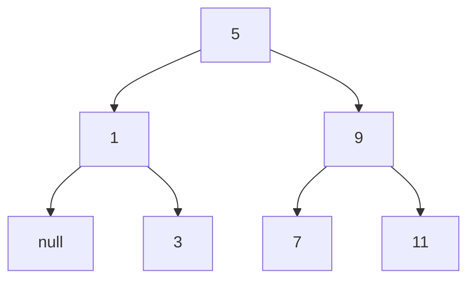

First, the algorithm creates a size for the left and right branch. The sum of the right and left size is always 1 smaller than n. Then the algorithm produces a subtree with the left length from before. Using the remainder of this subtree, the entry of the current node and the right tree is created. Because the input list is ordered, the algorithm can split the list into 3 parts and run recursively on those.

Because for every node the function gets called once the time complexity is O(n)