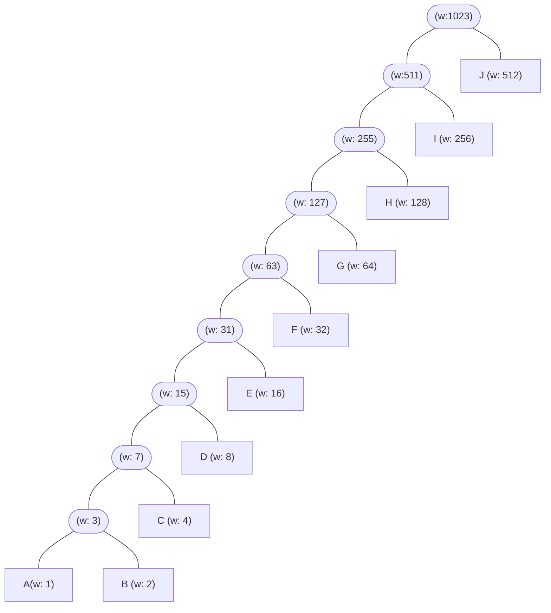

```mermaid
flowchart TB
    n1(["(w:1023)"]) --- n3(["(w:511)"])
    n4(["(w: 255)"]) --- n5(["(w: 127)"]) & n27["H (w: 128)"]
    n5 --- n6(["(w: 63)"]) & n26["G (w: 64)"]
    n6 --- n7(["(w: 31)"]) & n25["F (w: 32)"]
    n7 --- n8(["(w: 15)"]) & n24["E (w: 16)"]
    n8 --- n9(["(w: 7)"]) & n23["D (w: 8)"]
    n9 --- n10(["(w: 3)"]) & n22["C (w: 4)"]
    n3 --- n4 & n28["I (w: 256)"]
    n10 --- n11["A(w: 1)"] & n21["B (w: 2)"]
    n1 --- n29["J (w: 512)"]

```
The most frequent bit will always have 1 bit and the least frequent n - 1 bits