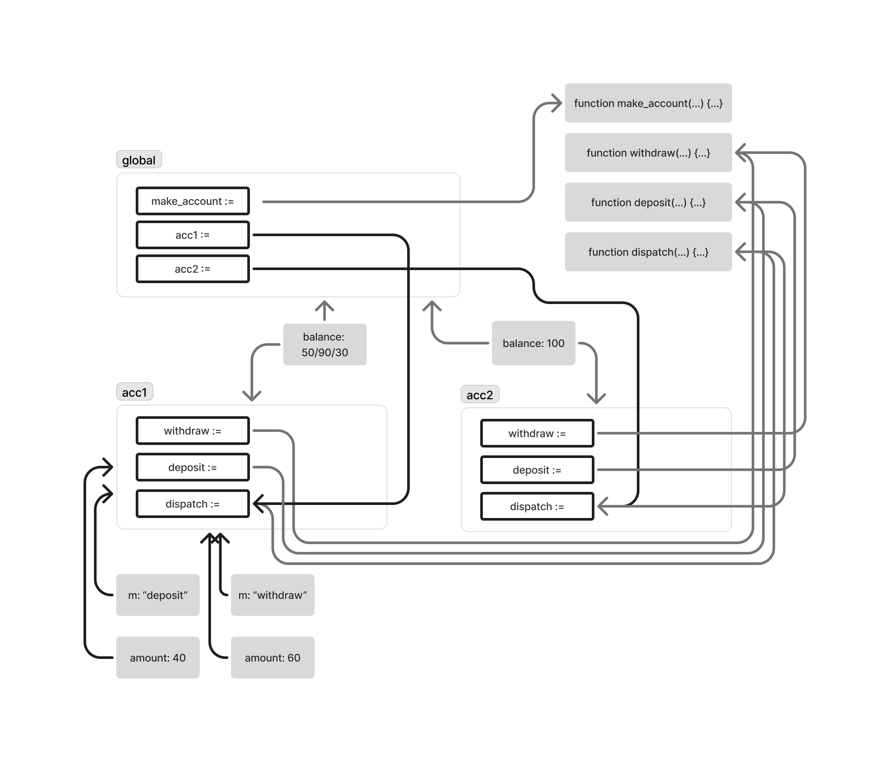

```js
function make_account(balance) {
  function withdraw(amount) {
    if (balance >= amount) {
      balance = balance - amount;
      return balance;
    } else {
      return 'Insufficient funds';
    }
  }
  function deposit(amount) {
    balance = balance + amount;
    return balance;
  }
  function dispatch(m) {
    return (
      m === 'withdraw' ? withdraw
      : m === 'deposit' ? deposit
      : error(m, 'Unknown request: make_account')
    );
  }
  return dispatch;
}


const acc = make_account(50);
acc("deposit")(40);
acc("withdraw")(60);
const acc2 = make_account(100);
```


When defining a second account they are in a second frame. However the values of the variables for the withdraw/deposit/dispatch function point to the same function they are called in a separate frame.