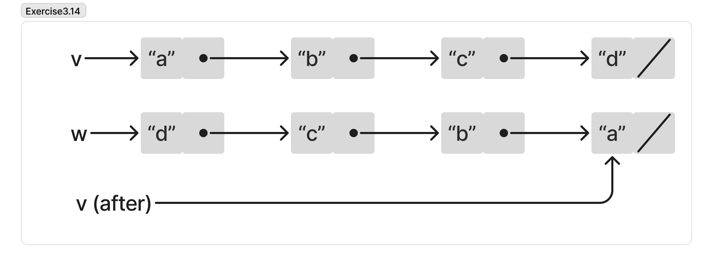

`mystery` reverts the order of a list. The edited variable points to the last element of the list when the function finished. 


`v` before call to `mystery`
```js
["a", ["b", ["c", ["d", null]]]]
```

`w` 
```js
["d", ["c", ["b", ["a", null]]]]
```

`v` after call to `mystery`
```js
["a", null]
```