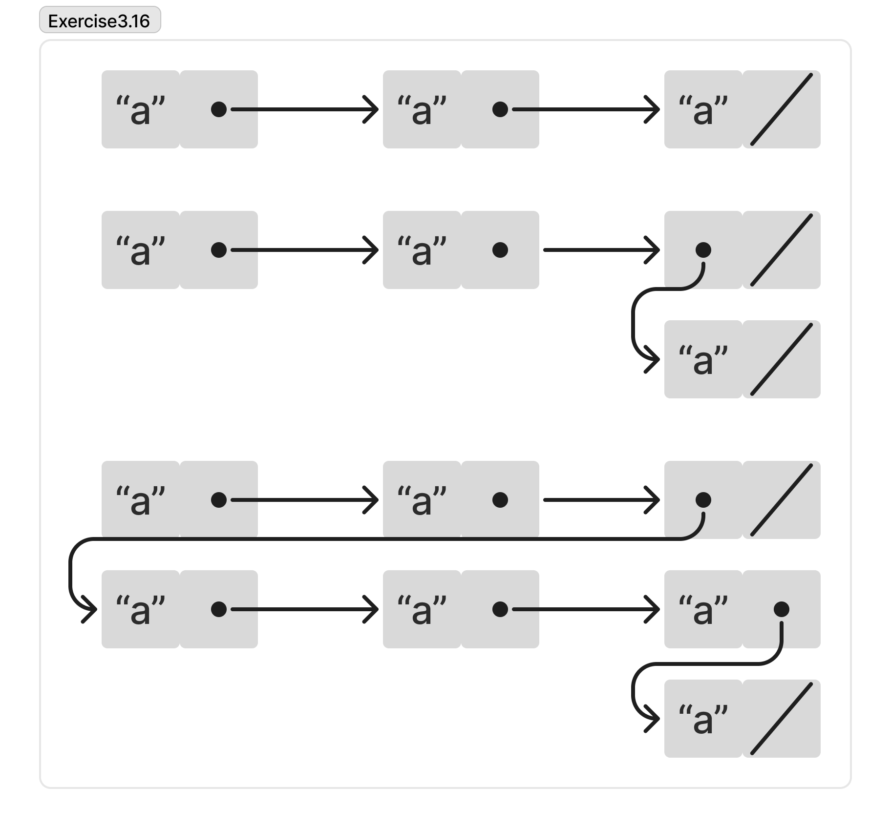

```js
const a = "a";

display(count_pairs(list(a, a, a)));
display(count_pairs(list(a, a, list(a))));
display(count_pairs(list(a, a, list(a, a, a, a))));

const x = list(a, a);
const y = set_tail(x, x);

count_pairs(x);
```




